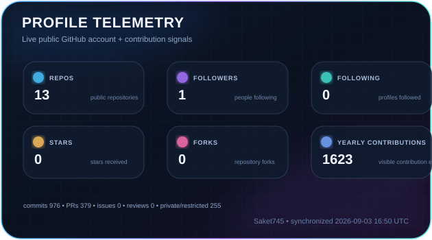
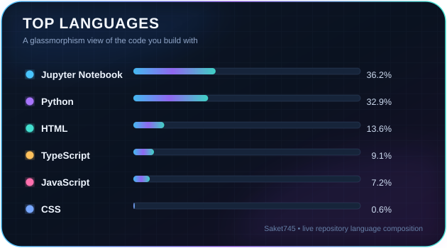
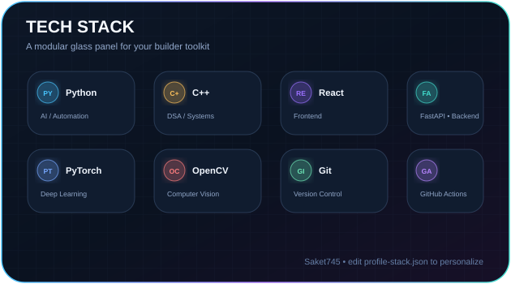
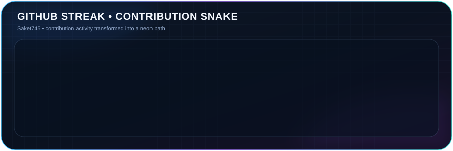

<div align="center">


# `Saket745`

### Data Engineering × AI/ML × Computer Vision

<a href="https://github.com/Saket745"></a>
<a href="https://www.linkedin.com/in/saket-maurya-de/"></a>
<a href="https://instagram.com/xen_hub"></a>

<br />

> **I build practical systems at the intersection of software, intelligence and experimentation.**
>
> Research → design → build → automate → measure → ship.

</div>

---

## ◈ LIVE PROFILE TELEMETRY

<p align="center">
  
</p>

<p align="center">
  <sub>Public GitHub account signals + contribution activity · automatically regenerated by GitHub Actions</sub>
</p>

## ◈ GLASSMORPHIC DASHBOARD

<p align="center">
  
</p>

<p align="center">
  
</p>

<p align="center">
  <picture>
    <source media="(prefers-color-scheme: dark)" srcset="./assets/widgets/github-snake-glass-dark.svg">
    <source media="(prefers-color-scheme: light)" srcset="./assets/widgets/github-snake-glass.svg">
    
  </picture>
</p>

---

## ◈ ENGINEERING FOCUS

<table>
<tr>
<td width="50%" valign="top">

### 🤖 AI / ML
Applied intelligence, experimentation and model-driven products.

### 👁️ Computer Vision
Image understanding, detection and vision pipelines.

### 🏗️ Data Engineering
Data systems, pipelines and structured problem solving.

</td>
<td width="50%" valign="top">

### 🧠 DSA / Systems
Algorithms, optimization and implementation fundamentals.

### ⚙️ Automation
GitHub Actions, repeatable workflows and developer tooling.

### 🌐 Creator Work
`xen_hub` — futuristic technology, AI and builder-oriented content.

</td>
</tr>
</table>

## ◈ BUILDER TOOLKIT

<p align="center">
  
</p>

## ◈ PROJECT MINDSET

```text
RESEARCH   → understand the trend and the real problem
DESIGN     → reduce the idea to a useful system
BUILD      → prototype quickly, engineer the core
AUTOMATE   → remove repeatable manual work
MEASURE    → learn from actual results
SHIP       → turn experiments into usable software
```

## ◈ HOW THE DASHBOARD UPDATES

```text
GitHub activity
      │
      ├── profile / repository metadata
      ├── contribution calendar
      ├── repository languages
      └── stars / forks / followers / following
                 │
                 ▼
        GitHub Actions workflow
                 │
                 ▼
      glass SVG widgets regenerated
                 │
                 ▼
          README renders them
```

The workflow runs on profile-repository changes and **hourly polling** for changes originating in other repositories. GitHub scheduled workflows can run later than the nominal schedule under platform load, so this is near-real-time rather than literally instantaneous. citeturn180022search0turn180022search5

---

## ◈ CONNECT

<div align="center">

<a href="https://github.com/Saket745">GitHub</a> ·
<a href="https://www.linkedin.com/in/saket-maurya-de/">LinkedIn</a> ·
<a href="https://instagram.com/xen_hub">xen_hub</a>

<br /><br />

### `BUILD → EXPERIMENT → LEARN → SHIP`

<sub>Built with GitHub Actions + GitHub API + glassmorphism SVGs.</sub>

</div>
