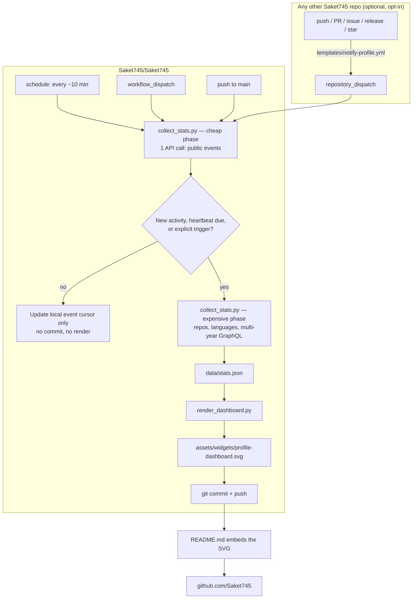

# Profile Intelligence — architecture & runbook

## What this replaces

This repo previously ran three parallel systems:

| Old piece | What it was | Why it's gone |
| --- | --- | --- |
| `scripts/generate_profile_dashboard.py` + `profile-dashboard.yml` | Inline SVG generator, GitHub Actions-native | Kept and rebuilt — this is the foundation of the new system. It was already the right idea, but was never actually embedded in `README.md` (it rendered and committed an SVG nobody's browser ever loaded). |
| `dashboard/` + `deploy-dashboard.yml` | Static site deployed to GitHub Pages | A separate user-facing application — the thing the new spec explicitly rules out. |
| `live-dashboard/` (Express server, WebSockets, GitHub App webhook, Dockerfile) | A always-on Node process that received GitHub App webhooks and had to be hosted somewhere (Render/Vercel/a box you run) | A standing server is exactly the "local machine / hosting dependency" the new spec rules out. It was also the *only* source of real cross-repo event detection — removing it meant that had to be replaced with something GitHub-native (see below). |

Net effect: one system, zero hosting, zero always-on process. The profile README **is** the application.

## Architecture

## Why polling *and* dispatch, not just one

GitHub's own Events API documentation is explicit that it is "not built for real-time use cases" — event latency can run from 30 seconds to 6 hours depending on load. That's true whether you poll it once a minute or once an hour. So:

- **Polling (`schedule`)** is the comprehensive, zero-touch layer. It works for every repo you own without editing any of them, but it inherits GitHub's own latency ceiling.
- **`repository_dispatch` (`templates/notify-profile.yml`)** is the instant layer. It never touches the Events API — it's one Action calling another Action's REST endpoint directly, so it's seconds, not minutes. It only needs to be added to repos you want instant coverage on.
- **`workflow_dispatch`** is the manual override — always forces a full recalculation.

Cost note: standard GitHub-hosted runners are free on public repositories, so a 10-minute schedule costs nothing. The cheap-phase design (below) keeps the actual API usage far lower than the tick rate suggests.

## Event-driven, not just "scheduled"

Every tick runs a **cheap phase** first: one call to `/users/Saket745/events/public`, compared against the last event id this repo committed. Most of the ~144 ticks/day exit right there with `changed=false` and touch nothing else — no repo listing, no language aggregation, no GraphQL, no commit. The **expensive phase** (the actual recalculation) only runs when:

- the cheap phase found a genuinely new public event, or
- a `workflow_dispatch` / `repository_dispatch` explicitly asked for one, or
- a 6-hour heartbeat has elapsed (catches drift that isn't a discrete event — e.g. a day rolling over for streak math — and provides a floor even if the Events API is slow to surface something).

This is what makes it "event-driven" rather than "runs on a timer and pretends": the timer just decides how often to *check*; whether real work happens depends on whether anything actually changed.

## Recalculation, not just retrieval

`data/stats.json` (committed, human-readable — a small stats API in its own right) holds figures GitHub's API doesn't hand you directly:

- **Lifetime contribution totals** — GraphQL's `contributionsCollection` is capped to roughly a one-year window per call, so the collector loops it year-by-year from account creation to now and sums the result. Completed past years are cached in `.state/lifetime-cache.json` and never re-fetched; only the current, still-accruing year is pulled live each run.
- **Current & longest contribution streak** — computed by walking the merged, de-duplicated daily calendar across every cached year.
- **Language mix** — aggregated from per-repo language byte counts, not just listed.

## Security model

No token is ever required for the system to run — with just the default `GITHUB_TOKEN` (auto-provided, zero setup) it produces a fully working dashboard from public data. Two optional upgrades, in order of preference:

1. **GitHub App installation token (`PROFILE_APP_ID` + `PROFILE_APP_PRIVATE_KEY` secrets)** — minted fresh inside the workflow via `actions/create-github-app-token`, expires in 1 hour, scoped to exactly what the App was granted, never stored anywhere. This is the same GitHub App *concept* `live-dashboard/github-app-manifest.json` used, minus the webhook and the server — it now exists purely to mint short-lived tokens on demand.
2. **Fine-grained PAT (`STATS_PAT` secret)** — simpler to set up, but long-lived. If you use this, scope it to read-only, set an expiry, and rotate it.

Either upgrade is used **only** to pull aggregate numeric contribution totals via GraphQL (the same category of aggregate private-contribution-count your public contribution graph already shows) — never to source the "Recent Activity" panel, which is always read from `/events/public` regardless of token strength. That panel is public-facing, so it only ever shows data that was already public.

`templates/notify-profile.yml` needs its own credential (`PROFILE_DISPATCH_TOKEN`) in each repo that adopts it — a fine-grained PAT scoped to only `Saket745/Saket745` with "Contents: Read and write" (that's what the `/dispatches` endpoint requires). Use `gh secret set --repos` to set it across many repos in one command instead of clicking through each repo's settings.

## Setup

Nothing is required to run the base system — it's already in this repo. Optional upgrades:

**A. Instant updates from another repo**
1. Copy `templates/notify-profile.yml` into that repo as `.github/workflows/notify-profile.yml`.
2. Create a fine-grained PAT scoped to only `Saket745/Saket745`, "Contents: Read and write", with an expiry.
3. `gh secret set PROFILE_DISPATCH_TOKEN --body "<token>" --repos <owner>/<repo>`

**B. Include private-repo contribution counts**
- Simple: add a fine-grained PAT as the `STATS_PAT` secret on this repo (`read:user`-equivalent, no repo content access needed).
- More secure: register a GitHub App (permissions: read-only `Metadata`; no webhook needed), install it on your account, and add `PROFILE_APP_ID` + `PROFILE_APP_PRIVATE_KEY` as secrets on this repo.

**C. Force a refresh right now**
- Actions tab → "Profile Intelligence" → Run workflow. `workflow_dispatch` always forces a full recalculation regardless of the idle/heartbeat gate.

## Known cleanup left on the table

`scripts/generate_widgets.py`, `scripts/wrap_snake.py`, and the SVGs under `assets/widgets/` other than `profile-dashboard.svg` (the snake graphs, `top-languages.svg`, `tech-stack.svg`, `profile-stats.svg`) are generated but were never referenced by `README.md` either, in the version of the repo this was built from. They're untouched here since they were out of scope for this change, but worth a look — either wire them into the README or remove them.
